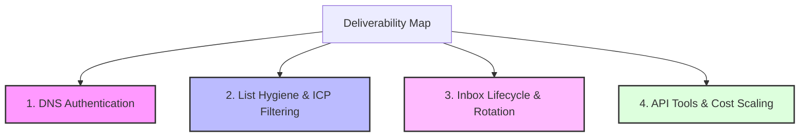

# Deliverability Workflow Map

*This is the central index for the agency's deliverability operations. It divides the entire campaign setup and maintenance pipeline into distinct, specialized sub-workflows.*

---

## 🗺️ Deliverability Architecture

Our deliverability health system is divided into four functional quadrants, each addressing a specific threat to inbox placement:

---

## 🛠️ The 4 Workflows

Click on each sub-workflow below to view detailed setup steps, audit instructions, specific tools, and troubleshooting guides:

### 🌐 [1. DNS Authentication Workflow](file:///c:/Users/Manveen/Desktop/new_things_to_mess_araound/infrabot/infra-bot/docs/workflow_dns_auth.md)
*   **Focus:** Domain-level identity verification (SPF, DKIM, DMARC).
*   **What we need:** Complete, error-free DNS records for all secondary domains.
*   **Owner:** Campaign Managers (for manual setup) & `infra-bot` (for automated P0/P1 daily checks).
*   **Quick Summary:** Verifying records against strict rules (e.g. no `+all` wildcards, 2048-bit DKIM keys, enforcing DMARC quarantine/reject policies).

### 🧼 [2. List Hygiene & ICP Filtering Workflow](file:///c:/Users/Manveen/Desktop/new_things_to_mess_araound/infrabot/infra-bot/docs/workflow_list_hygiene.md)
*   **Focus:** Bounce rate reduction (target < 1%, stop if > 5%) and e-commerce Store Leads targeting.
*   **What we need:** Highly verified lead lists matching exact client Ideal Customer Profiles (ICPs).
*   **Owner:** Lead Gen Managers (Anjali, Varsha, Baloo).
*   **Quick Summary:** Cleaning Catch-Alls, filtering e-commerce data based on employee count rather than unreliable revenue data, and utilizing US-activity agents.

### 🔄 [3. Inbox Lifecycle & Rotation Workflow](file:///c:/Users/Manveen/Desktop/new_things_to_mess_araound/infrabot/infra-bot/docs/workflow_inbox_lifecycle.md)
*   **Focus:** Account reputation building and automatic fallback rotation.
*   **What we need:** A steady pipeline of warmed bench domains and automatic swap capabilities.
*   **Owner:** Campaign Managers & `infra-bot` (automated rotation).
*   **Quick Summary:** Provisioning domains via Scaled Mail, adding new sender profiles (e.g. Aaron Expandee), keeping trickle warmup ON, and swapping broken senders.

### ⚙️ [4. API Tools & Cost Scaling Workflow](file:///c:/Users/Manveen/Desktop/new_things_to_mess_araound/infrabot/infra-bot/docs/workflow_api_tools.md)
*   **Focus:** Technical pipeline scalability, cost controls, and API configurations.
*   **What we need:** Cost-viable scrapers and API-driven automation scripts.
*   **Owner:** Tech Lead (Manveen).
*   **Quick Summary:** LinkedIn finder pricing problem (evaluating alternatives to 85 Compute), Smartlead API threading capabilities, and CLI test suites.

---

## 📅 Today's Deliverability Sync

For a summary of today's technical deliverability goals, open questions, and code implementations:

📌 **[July 07 Deliverability Sync & Meeting Prep](file:///c:/Users/Manveen/Desktop/new_things_to_mess_araound/infrabot/infra-bot/docs/MEETING_PREP_JULY_07.md)**
